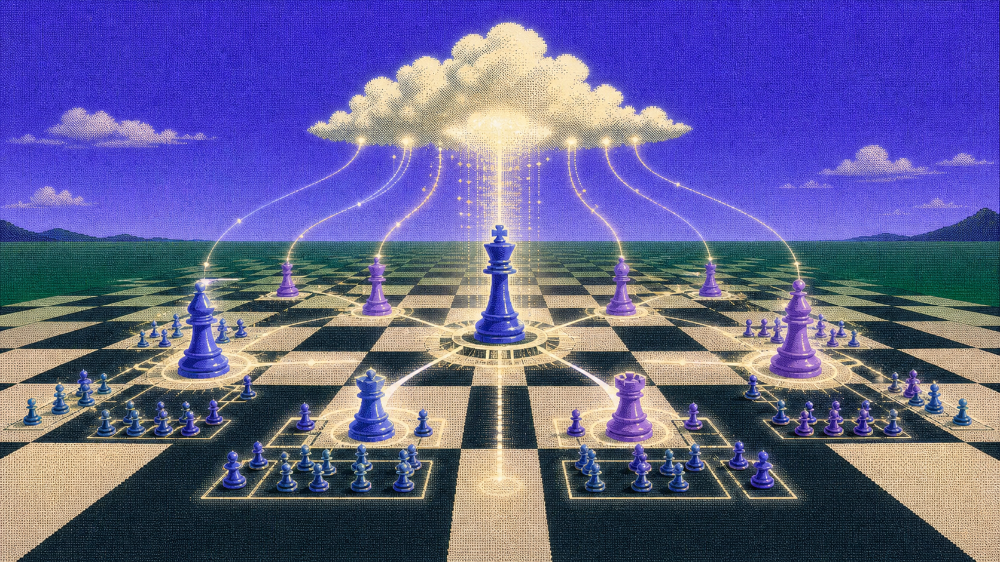
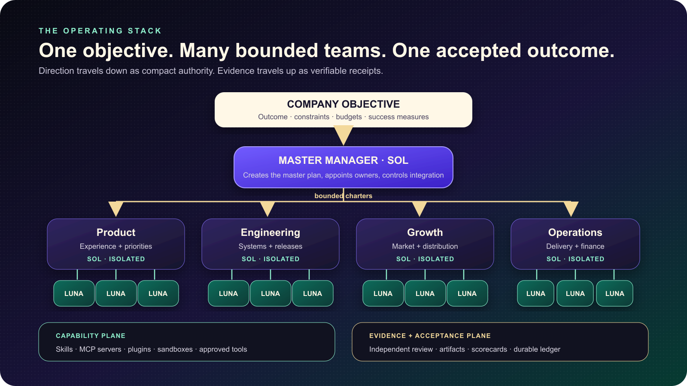
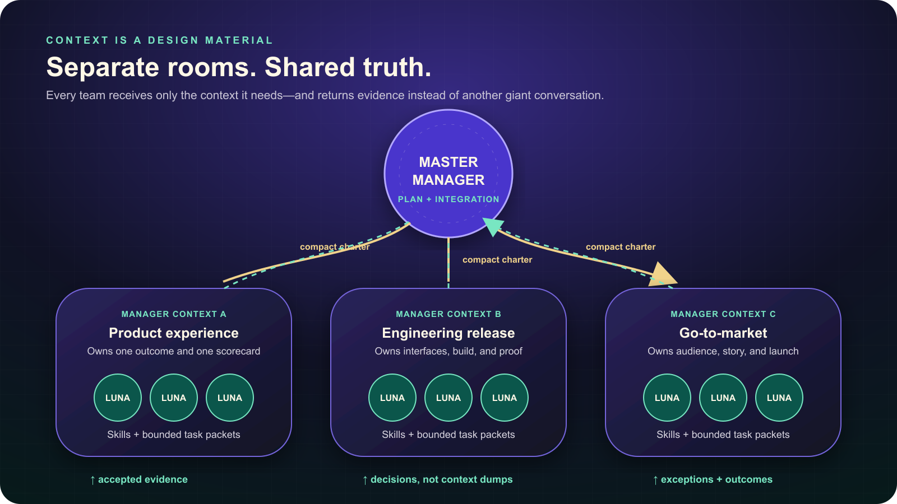
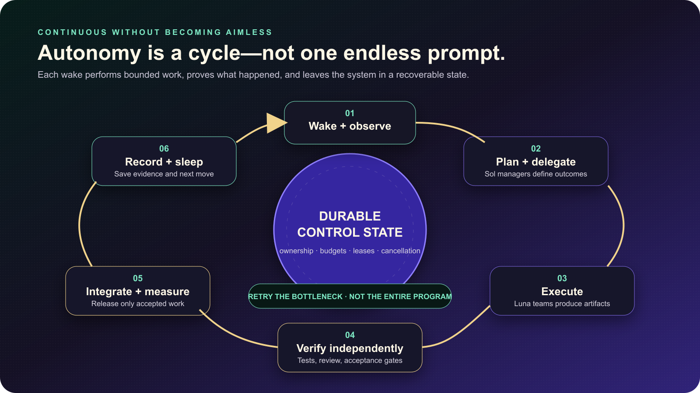

# Company OS

## An operating framework for AI-native companies

**Turn one concrete company objective into a master plan, parallel programs, accepted deliverables, and measurable business outcomes.**

Company OS is a reusable operating framework for coordinated AI work. It is not a single all-knowing agent, and it is not a company by itself. It gives a company a management structure: one master manager sets direction, specialist managers own programs, worker teams execute bounded tasks, and independent acceptance gates decide what is allowed to move forward.

The goal is simple: make AI teams behave less like an improvised group chat and more like a high-performing organization.

> **In one sentence:** Company OS separates direction, management, execution, and verification so many agents can work in parallel without losing the objective or silently lowering the quality bar.

---

## Why a single agent is not a company

A single conversation eventually becomes responsible for too much: strategy, research, project management, writing, coding, design, testing, memory, tools, and approvals. As the context grows, three predictable problems appear:

- **Direction blurs.** The original objective competes with thousands of implementation details.
- **Work becomes serial.** One agent tries to do every job in one line instead of letting independent teams move at once.
- **Review becomes self-review.** The same context that produced the work is asked to judge it, making blind spots harder to catch.

Company OS changes the unit of work. Instead of asking one agent to “handle the company,” it creates small, owned programs with explicit outcomes, limits, evidence, and acceptance decisions.

---

## The operating stack

### 1. The objective

Every program begins with a concrete objective: the desired outcome, non-negotiable constraints, available budget, decision rights, and measures of success. If the objective is still ambiguous, the master manager’s first job is to clarify it before execution begins.

### 2. The master manager

The master manager is the control layer. Its job is not to do everybody else’s work. It converts the objective into a coherent master plan, establishes interfaces between programs, appoints program managers, controls shared budgets, resolves cross-team conflicts, and accepts or rejects integration decisions.

The intended routing policy uses **GPT-5.6 Sol with extra-high reasoning** for this layer, because planning, decomposition, tradeoffs, and final judgment have the highest leverage.

### 3. Program managers

Each manager owns one bounded outcome—for example, a product experience, an engineering release, a growth campaign, or an operating system. A manager receives a compact charter and enough shared context to understand the company objective, but it operates in a separate task so local details do not flood the master context.

Managers can form their own small teams, assign skills, inspect work, request bounded rework, and report decisions back to the master. Their responsibility is complete delivery, not activity. The intended routing policy also uses **GPT-5.6 Sol with extra-high reasoning** for manager threads, while keeping each manager’s context limited to its program.

### 4. Luna worker teams

Workers receive small task packets with exact deliverables, owned files or artifacts, constraints, tests, and a reporting destination. The intended policy routes high-volume execution to **GPT-5.6 Luna at maximum reasoning**. That keeps expensive management context focused while allowing many bounded tasks to move in parallel.

Workers do not approve their own work. They return artifacts and evidence to their manager, who independently inspects the result.

### 5. Capabilities and evidence

Skills, MCP servers, plugins, sandboxes, browsers, repositories, and business systems live in a capability plane shared by the organization. They expand what a team can do, but they do not automatically expand what a team is allowed to do.

Every accepted result should leave durable evidence: the artifact, tests or review results, ownership, decisions, known limitations, and the next authorized move.

---

## Separate rooms, shared truth

Context separation is one of the framework’s core design choices.

The master manager should know the objective, master plan, program interfaces, material risks, and accepted outcomes. It should not carry every line of code, research transcript, design exploration, or worker conversation.

Each program manager receives a bounded working room. Each worker receives an even smaller packet. Information moves between levels in deliberate forms:

- **Downward:** objectives, authority, constraints, budgets, interfaces, and acceptance criteria.
- **Upward:** artifacts, evidence, exceptions, score changes, and decisions.
- **Sideways:** only explicit interface contracts and approved dependencies.

This structure reduces context drift because a team cannot silently redefine the company objective from inside a local task. It supports parallelism because independent programs can advance without writing into the same context or artifact at the same time. It also improves review because the manager evaluates a worker’s output from a different context.

It does not magically eliminate hallucinations. It makes them easier to contain, detect, and reject before integration.

---

## Skills without prompt bloat

A large organization may have thousands of useful playbooks: software testing, interface design, market research, financial modeling, content, legal review, security, browser automation, video, sales, and more. Loading all of them into every task would make the system slower and less precise.

Company OS uses a governed capability-library pattern:

1. **Index metadata, not entire skill bodies.** Managers search compact descriptions and constraints.
2. **Select the smallest useful set.** A worker receives only the approved skills required for its task.
3. **Bind the assignment to the task.** The selected skill, version, digest, role, and entrypoint travel with the work packet.
4. **Load lazily.** Full instructions enter context only after assignment.
5. **Fail closed on drift.** If the approved skill bytes or assignment proof no longer match, dispatch stops.

The current capability campaign has indexed **2,633 candidate entries from 23 external sources** while keeping them non-dispatchable by default. Twelve standalone skills have been curated into the first controlled catalog, and the source slice passed independent review at **9.2 / 10**. Installation, current-worker execution, Luna routing, and runtime readiness remain separate gates. This is the intended posture: broad discovery, narrow trust.

---

## Tools, MCP servers, and plugins

MCP servers and plugins let teams reach the systems where real company work happens: repositories, databases, documents, CRM systems, calendars, messaging, design tools, browsers, cloud platforms, and custom internal applications.

Company OS treats a tool connection as a capability—not as permission. A manager must still bind the tool to a task, tenant or project, allowed action, budget, and acceptance path. A worker that can read a database should not automatically be able to change it. A worker that can draft a message should not automatically be able to send it.

This separation makes the framework extensible without turning every integration into unrestricted authority.

---

## Strict auditing without stopping progress

The framework uses four distinct decisions:

1. **Design:** Is the plan coherent, owned, bounded, and worth executing?
2. **Execution:** Did the assigned team produce the required deliverable within scope?
3. **Verification:** Does independent evidence show that the deliverable meets the acceptance criteria?
4. **Integration:** Is this accepted result allowed to affect the shared product, company system, customer, or production environment?

These gates prevent “the test passed” from becoming an accidental production approval. They also prevent endless ceremony: a reproduced bottleneck should be repaired at the smallest useful boundary, rerun, and then challenged with a materially different task.

Useful operating measures include:

- first-pass acceptance rate;
- rework rate and reason;
- time from objective to accepted outcome;
- worker utilization and manager review load;
- write collisions and ownership conflicts;
- cancellation and recovery success;
- cost and token usage by outcome;
- quality scores across product, engineering, security, usability, brand, and business impact.

The target is not more agent activity. It is more accepted business progress per unit of time and cost.

---

## Continuous operation

Schedulers can wake Company OS on a cadence or in response to a real event. A useful wake does not merely ask an agent to “keep going.” It reconstructs the current objective, ownership, accepted state, open bottlenecks, budget, and next authorized decision.

The operating cycle is:

1. **Wake and observe** the durable state.
2. **Plan and delegate** only the next bounded programs.
3. **Execute** through manager-owned worker teams.
4. **Verify independently** against explicit acceptance criteria.
5. **Integrate and measure** only accepted work.
6. **Record and sleep** with a clear next move.

To operate reliably for long periods, a deployment also needs durable job state, ownership leases, heartbeats, idempotency, cancellation, retries, and recovery. A scheduler alone is not autonomy; it is only the alarm clock.

---

## A concrete example: launching a new software product

Imagine the objective is: **launch a polished vertical SaaS product to ten design partners in six weeks without disrupting the existing platform.**

The master manager creates the program map and shared release criteria. It appoints separate managers:

- **Product manager:** defines the user journey, requirements, and experience scorecard.
- **Research manager:** validates the problem, customer language, alternatives, and innovation opportunities.
- **Design manager:** produces the interaction system, visual assets, motion rules, and usability proof.
- **Engineering manager:** owns architecture, implementation, tests, migration safety, and release evidence.
- **Go-to-market manager:** builds positioning, launch content, outreach, and feedback capture.
- **Operations manager:** creates onboarding, support, finance, risk, and reporting procedures.

Each manager forms a small Luna team and assigns only the skills needed for that program. Product and engineering exchange an interface contract rather than their full working contexts. Design supplies approved assets and behavior specifications. Go-to-market cannot promise a feature that engineering has not accepted. Operations does not mark launch readiness until the evidence package is complete.

The master manager receives program decisions and accepted artifacts, resolves the remaining tradeoffs, and authorizes integration. The result is one release assembled from independent, reviewable programs—not six agents talking over one another in a single thread.

---

## What makes the framework different

### Management is explicit

Agents have named outcomes, owners, budgets, reporting paths, and stop conditions. “Autonomous” does not mean ownerless.

### Parallelism is earned

The system starts with small concurrency, proves that ownership and recovery work, and scales only when the evidence supports it. More agents are useful only when their boundaries are clear.

### Quality is independent

Worker completion is not manager acceptance. Manager acceptance is not production permission. Each claim has a separate evidence boundary.

### The framework is elastic

The same operating structure can be cloned around a software company, real-estate brokerage, commerce brand, investment workflow, or internal operating program. The objective, departments, skills, metrics, and integrations adapt; the ownership and evidence principles remain stable.

### Innovation remains first-class

Evidence should challenge and refine a bold product insight, not prevent the team from pursuing anything that has never existed. Company OS can treat an original idea as a bounded innovation bet with a hypothesis, budget, learning measure, and kill or scale decision.

---

## Current status

Company OS is an actively developed framework with implemented role contracts, program preflight compilation, bounded worker packets, capability discovery, artifact verification, and evidence-oriented release gates. Real manager-to-worker simulations have produced accepted software, finance, and operations artifacts and have also exposed framework defects that were converted into targeted repairs.

It should not yet be represented as a fully proven, unattended production runtime for hundreds of agents. The remaining proof is operational: clean end-to-end runtime activation, scheduler recovery, observed model routing, high-concurrency collision testing, and repeated real-company programs meeting the acceptance and rework targets.

That distinction is intentional. Company OS is being built to make truthful execution scalable—not to make autonomy claims faster than the evidence.

---

## The product promise

**Give Company OS a concrete company objective. It creates the management structure, equips each team, moves work in parallel, rejects weak outputs, records what happened, and returns accepted business progress.**

The long-term opportunity is not a better chatbot. It is an operating layer that lets a small human leadership team direct a large, disciplined, tool-using digital organization—continuously, measurably, and with control.
